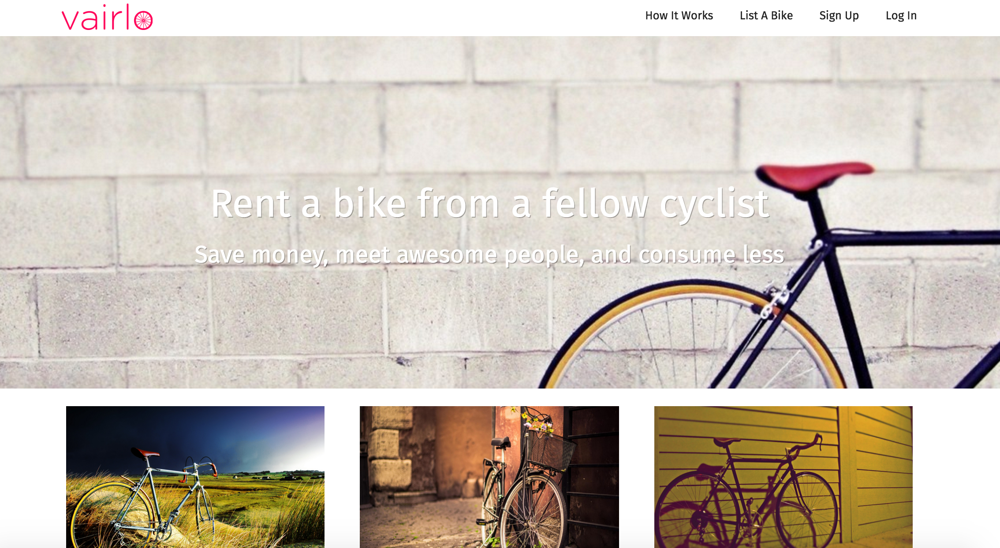

#Ruby on Rails Web Application

##Vairlo

### About Vairlo
Vairl is a bike lending and renting application built with Ruby on Rails. 

[Try it out here](https://http://vairlo.heroku-app.com/)

### The App
####Functionality and How it works
1. Users sign up and login
2. Users can browse bikes based on location and availability.
3. Users can also post their own bikes available for rent.

###Approach and build
1. Ruby on Rails Application
2. The following Ruby gems were used:
    - gon - Used to send data to javascript files
    - Bookable - used for booking capabilities
    - Geocoder - used for google maps location services
    - Carrier Wave - used to allow user uploads of images
    - Devise - used for authentication
3. Foundations framework used for styling and sass css.
4. HTML5 as HTML (Rails) erb files
5. JavaScript was used in conjunction with Ruby.

## Problems / Solutions
- Implementing ruby data within javascript was a challenge that was ovecome with the ruby gem Gon.
